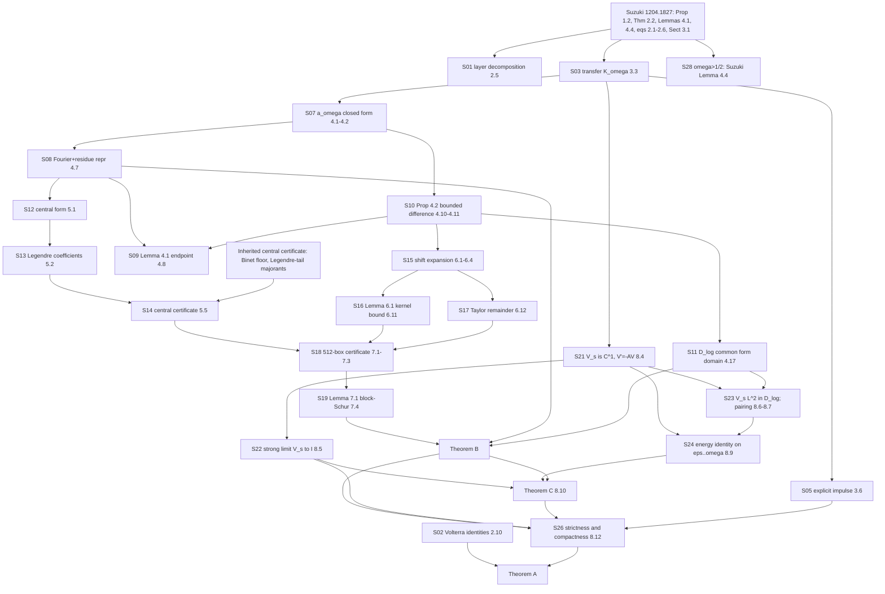

# Statement inventory — *Archimedean first-slab positivity for shifted zeta canonical systems*

**Version:** preprint v1.0 (5 Sept 2026), `papers/first-slab-positivity/first_slab_positivity.pdf`
**Machine-readable twin:** `statements/ledger.yaml` (ids `fs:S01`–`fs:S30`)
**Human-check ids** refer to `verification/first-slab/CHECKLIST.md`.

Notation throughout: $\xi(s)=\tfrac12 s(s-1)\pi^{-s/2}\Gamma(s/2)\zeta(s)$;
$\Gamma_\infty(s)=\tfrac12 s(s-1)\pi^{-s/2}\Gamma(s/2)$; $\alpha=\tfrac12-\omega$, $\beta=\tfrac12+\omega$;
$I_L=(-L/2,L/2)$; $\widehat f(\tau)=\int_{I_L} f(x)e^{-i\tau x}dx$;
$\mathcal C_c(f)=\int_{I_L} f\cosh(cx)$, $\mathcal S_c(f)=\int_{I_L} f\sinh(cx)$;
$R(t)=e^{t/2}-e^{-5t/2}/(1-e^{-2t})$.

## Dependency graph

The graph shows the proof chain of Theorems A, B, C. Four standalone
identities not on that chain (S04 factorization, S06 Sonine, S29 modular
endpoint, S30 Dirichlet series) appear in the inventory only.

Heavy arrows in words: **Theorem A** = Volterra identities (S02) + strictness
(S26). **S26** needs Theorem C (S25), uniform coercivity (Theorem B via S19),
the strong limit (S22) and compactness of $V_{s,L}$ (from S05).
**Theorem C** is the §8 chain S21 → S22/S23 → S24 → S25, with Theorem B
making the integrand nonnegative. **Theorem B** = the certificate stack
S14 + S16 + S17 + S18 closed by S19, plus horizon-independence from S08/S11.

## Inventory

Status key: `paper` proved on paper · `computer` interval-certified · `numeric` numerically verified only · `cited` · `asserted`. Human check: ⬜ not yet · 🔶 automated reading only · ✅ done.

| Id | Statement (self-contained) | Where | Status | Human check | Formalization |
|---|---|---|---|---|---|
| S01 | With $c_\omega(n)=n^\omega\sum_{d\mid n}\mu(d)d^{-2\omega}$, $h_\omega(x)=x^{-1}\sum_{n\le x}c_\omega(n)g_\omega(n/x)$ for $x>1$ (Suzuki), $k_\omega(t)=e^{t/2}h_\omega(e^t)$ and $\kappa_\omega(t)=e^{-t/2}g_\omega(e^{-t})\mathbf 1_{t>0}$: $k_\omega(t)=\sum_{n\ge1}c_\omega(n)n^{-1/2}\kappa_\omega(t-\log n)$. For a sum-coordinate interval of length $L<\log 2$ only $n=1$ contributes; at $L=\log2$ the $n=2$ term lies on a null set. | (2.5), §2.1 | paper (change of variables from Suzuki eq. 2.3) | 🔶 C1 | easy once $g_\omega,h_\omega$ are defined; the content is Suzuki's definitions |
| S02 | On $L^2(0,L)$ with $(V f)(x)=\int_0^x\kappa(x-y)f(y)dy$, $(Rf)(x)=f(L-x)$, $(Hf)(x)=\int_0^L\kappa(x+y-L)f(y)dy$, $\kappa\in L^1$ supported in $t>0$: $H=VR=RV^*$, $RVR=V^*$, $H^2=VV^*$; hence $H=H^*$, $\|H\|=\|V\|$, and $I\pm H\succ0\iff\|V\|<1$. | (2.10)–(2.11), §2.2 | paper | ⬜ A4 (✅ referee recomputation) | **moderate** — Bochner/Lebesgue change of variables in Mathlib; operator adjoint on `L2` |
| S03 | $K_\omega(p):=\int_0^\infty\kappa_\omega(t)e^{-pt}dt=\Gamma_\infty(\tfrac12+p-\omega)/\Gamma_\infty(\tfrac12+p+\omega)$, equivalently Suzuki's $\int_0^\infty g_\omega(x)x^s\,dx/x=\gamma(s-\omega)/\gamma(s+\omega)$ with $\gamma=\Gamma_\infty$, $s=p+\tfrac12$. | (3.2)–(3.3), §3.1 | cited (Suzuki Sect. 3.1) | 🔶 C1 | depends on a definition of $g_\omega$; hard (Mellin transform of an explicit Beta-type function) |
| S04 | $K_\omega(p)=\pi^\omega\frac{(p+\alpha)(p-\beta)}{(p-\alpha)(p+\beta)}\frac{\Gamma((p+\alpha)/2)}{\Gamma((p+\beta)/2)}$. | (3.5) | paper (algebra, uses $\alpha+\beta=1$) | ✅ | easy (`Complex.Gamma` algebra) |
| S05 | The explicit formula (3.6) for $\kappa_\omega$ (incomplete-Beta form) has Laplace transform $K_\omega$; $\kappa_\omega(t)=O(t^{\omega-1})$ as $t\downarrow0$, so $\kappa_\omega\in L^1(0,L)$ and $V_{\omega,L}$ is compact (Hilbert–Schmidt after truncation + Young). | (3.6), §3.2, §8.6 | numeric (transform verified to 1.5e−17 / 1e−10); compactness: paper | ⬜ (formula derivation not written out in the paper) | hard (incomplete Beta function not in Mathlib); compactness: moderate |
| S06 | Sonine identity $a_\omega*b_\omega=2e^{-\alpha t}$ for $a_\omega=\frac{2}{\Gamma(\omega)}e^{-\alpha t}(1-e^{-2t})^{\omega-1}$, $b_\omega=\frac{2}{\Gamma(1-\omega)}e^{-\beta t}(1-e^{-2t})^{-\omega}$; rational collapse (3.11). *Not used in the main chain.* | (3.10)–(3.11) | paper (Beta-function recurrence) | ✅ | moderate (`Real.Beta`/Gamma recurrence exists) |
| S07 | With $G(p)=\Gamma_\infty(\tfrac12+p)$, $\ell=\log G$: $\partial_\omega K_\omega=-a_\omega K_\omega$, $a_\omega(p)=\ell'(p-\omega)+\ell'(p+\omega)=\sum\frac1{p\pm\alpha}+\sum\frac1{p\pm\beta}-\log\pi+\tfrac12\psi(\tfrac{p+\alpha}2)+\tfrac12\psi(\tfrac{p+\beta}2)$. | (4.1)–(4.2) | paper | ✅ | **easy–moderate** (log-derivative of Gamma; Mathlib has `Complex.Gamma` and its derivative; digamma as `deriv (log ∘ Gamma)`) |
| S08 | For $0\le\omega<\tfrac12$ and $f$ supported in $I_L$: $Q_{\omega,L}[f]=\frac1{2\pi}\int_{\mathbb R}w_\omega(\tau)\lvert\widehat f(\tau)\rvert^2d\tau+\lvert\mathcal C_\alpha(f)\rvert^2+\lvert\mathcal C_\beta(f)\rvert^2-\lvert\mathcal S_\alpha(f)\rvert^2-\lvert\mathcal S_\beta(f)\rvert^2$, $w_\omega(\tau)=\tfrac12\mathrm{Re}\,\psi(\tfrac{\alpha+i\tau}2)+\tfrac12\mathrm{Re}\,\psi(\tfrac{\beta+i\tau}2)-\log\pi$. Even/odd sectors decouple. | (4.5)–(4.7), §4.2 | asserted ("contour displacement gives"); numeric (Fourier side vs kernel side to 1e−11 at ω = 0.3, 0.45) | ⬜ (no checklist item — flagged here) | hard (Plancherel + residue calculus for the pole terms) |
| S09 | **Lemma 4.1.** At $\omega=\tfrac12$: $Q_{1/2,L}[f]=\frac1{2\pi}\int w^{\rm pt}_{1/2}\lvert\widehat f\rvert^2+\tfrac12\lvert\mathcal C_0(f)\rvert^2+\lvert\mathcal C_1(f)\rvert^2-\lvert\mathcal S_1(f)\rvert^2$, where $w^{\rm pt}_{1/2}$ is the pointwise limit of $w_\omega$; i.e. $\tfrac12\mathrm{Re}\,\psi(\tfrac{\alpha+i\tau}2)\to\tfrac12\mathrm{Re}\,\psi(\tfrac{i\tau}2)-\pi\delta_0$ in distributions. | (4.8) | paper | ⬜ A2 (✅ numeric: agrees with $Q_0+C_{1/2}$ to 7.5e−8; uncorrected off by 0.2402) | hard (distributional limit) |
| S10 | **Prop. 4.2.** For $0\le\omega\le\tfrac12$: $Q_{\omega,L}=Q_{0,L}+C_{\omega,L}$, $C_{\omega,L}$ the integral operator on $I_L$ with kernel $c_\omega(x,y)=(\cosh(\omega\lvert x-y\rvert)-1)R(\lvert x-y\rvert)$. Core identity: $a_\omega(p)-a_0(p)=\int_0^\infty e^{-pt}\,2(\cosh\omega t-1)R(t)\,dt$ for $\mathrm{Re}\,p$ large. | (4.10)–(4.16), §4.3 | paper | ⬜ A1 (✅ every step recomputed to 30+ digits at ω = 0.3, ½) | moderate–hard: needs the digamma integral representation $\psi(z)=-\gamma+\int_0^\infty\frac{e^{-u}-e^{-zu}}{1-e^{-u}}du$ (not in Mathlib as far as we know) plus the cancellation step; the rational and bridge steps (4.14)–(4.15) are easy |
| S11 | $R(t)=-\tfrac1{2t}+O(1)$, so $c_\omega(x,y)=O(\lvert x-y\rvert)$ at the diagonal; $C_{\omega,L}$ is Hilbert–Schmidt; all $Q_{\omega,L}$ are closed on $\mathcal D_{\log}(I_L)=\{f\in L^2:\int\log(2+\lvert\tau\rvert)\lvert\widehat f\rvert^2<\infty\}$. | (4.17), §4.4 | paper | ⬜ (part of A1's context) | moderate (Hilbert–Schmidt kernels exist in Mathlib; closed forms via bounded perturbation — form theory is thin) |
| S12 | $Q_{0,L}[f]=\frac1{2\pi}\int[\mathrm{Re}\,\psi(\tfrac14+\tfrac{i\tau}2)-\log\pi]\lvert\widehat f\rvert^2+2\lvert\mathcal C_{1/2}(f)\rvert^2-2\lvert\mathcal S_{1/2}(f)\rvert^2$; unbounded above on $L^2$, lower bounded and closed on $\mathcal D_{\log}$; parity-diagonal. | (5.1) | paper (specialization of S08) | ✅ | inherits S08 |
| S13 | For the normalized Legendre basis $\phi_n$ on $(-T_0,T_0)$, $T_0=\tfrac12\log2$: $\widehat\phi_n(\tau)=\sqrt{2T_0(2n+1)}(-i)^nj_n(T_0\tau)$, $p_n=\sqrt{2T_0(2n+1)}\,i_n(T_0/2)$. | (5.2) | paper | ✅ | moderate (spherical Bessel functions: Mathlib has Bessel only partially) |
| S14 | **Central certificate.** $Q_{0,\log2}[f]\ge 9.9999859\times10^{-4}\lVert f\rVert^2$ (even), $\ge4.99999998\times10^{-2}\lVert f\rVert^2$ (odd): 16-mode Arb interval LDLᵀ with $10^{-10}$ entrywise radii, floor $\beta_*=\log\frac{30}{2\pi}-\frac1{30}$ for $\lvert\tau\rvert\ge30$, head–tail couplings $1.4084884\times10^{-9}$ / $2.2191643\times10^{-10}$, tail deviations $9.7777\times10^{-24}$ / $2.4269\times10^{-25}$; Weyl inequality. | (5.3)–(5.5), §5.3 | computer (Arb) — **inherits** the Binet floor and the spherical-Bessel tail majorants from Investigation 7 | ⬜ D1 (majorants), ✅ head reconstructed independently | certificate (verified interval checker over stored matrices; the tail majorants would need their own formal proof) |
| S15 | $S(t)=tR(t)=te^{t/2}-\tfrac12e^{-3t/2}\frac{t}{\sinh t}$ is analytic on a disk containing $[0,\log2]$; $C_{\omega,L}=\sum_{k\ge1}\omega^{2k}T_{k,L}$ with kernel $\lvert x-y\rvert^{2k}R(\lvert x-y\rvert)/(2k)!$; $(T_{k,L})_{mn}=\frac{\sqrt{(2m+1)(2n+1)}}{(2k)!}\sum_j[u^j]C_{mn}(u)\sum_d\frac{s_dL^{d+2k}}{d+2k+j}$ with $C_{mn}(u)=\tfrac12\int_{-1}^{1-2u}[P_m(r+2u)P_n(r)+P_n(r+2u)P_m(r)]dr$. | (6.1)–(6.4) | paper | ✅ (referee re-derivation) | moderate (Legendre polynomials exist; power-series manipulation) |
| S16 | **Lemma 6.1.** $\lVert C_{\omega,L}\rVert\le\int_0^{\log2}\lvert h\rvert\le0.012293050401142320<0.012294$ for $0\le\omega\le\tfrac12$, $0<L\le\log2$, where $h(t)=(\cosh\tfrac t2-1)R(t)=\frac{(q-1)(q^6-q^2-1)}{2q^2(q+1)(q^2+1)}$, $q=e^{t/2}$; $R$ changes sign once at $t_0=\log\rho$, $\rho^3=\rho+1$; $\mathrm{sign}\,h'=\mathrm{sign}\,N(q)$, $N'(q)>0$ for $q\ge1$, $N(1)=-2$, $N(\sqrt\rho)=3\rho^2-1$; unique minimum $t_m$; endpoint-row maximum via $a\ge L/2>t_0$ and $h(\log2-t_0)+h(t_m)>0.00817039$. | (6.5)–(6.11) | paper (monotonicity) + computer (Arb scalar enclosures) | ⬜ A3 (✅ all constants recomputed) | **easy** for the polynomial part (closed form of $h$, $N'>0$ by `nlinarith`/`positivity`, $N(1)$, $N(\sqrt\rho)$); moderate for the interval enclosures of $t_m$, $h(t_m)$, $\int\lvert h\rvert$ (needs verified quadrature); Schur test: moderate |
| S17 | $\sup_{0\le\omega\le1/2}\lVert C_{\omega,L}-\sum_{k=1}^4\omega^{2k}T_{k,L}\rVert<1.54\times10^{-12}$ (Arb enclosure $1.532967865231399\times10^{-12}$, conservative Cauchy bound). | (6.12) | paper (Cauchy remainder) + computer | ✅ recomputed | moderate |
| S18 | **Box certificate.** For each of 256 boxes covering $[0,\tfrac12]$ and each parity, interval LDLᵀ proves $\lambda_{\min}(\text{head}_\omega)\ge m+\kappa^2/d_{\rm tail}$ with $d_{\rm tail}=\beta_*-\delta_{\rm central}-0.012294>1.5176929819194764$, $\kappa=\kappa_{\rm central}+0.012294$; minimum margins $m=6.116350109501\times10^{-4}$ (even), $5.261670009275\times10^{-2}$ (odd); smallest pivot $2.326811914886\times10^{-2}$. Clean-room audit: all 512 boxes pass, margins $6.116514636999\times10^{-4}$ / $5.261670255041\times10^{-2}$. | (7.1)–(7.3), §7.1–7.2, §7.6 | computer (Arb; audited) | ⬜ D2, D3, D4 (✅ Schur loss, head minima reconstructed) | certificate (stored interval matrices + a verified LDLᵀ checker; Flyspeck-style) |
| S19 | **Lemma 7.1 (block-Schur).** If $Q[f_h]\ge\lambda\lVert f_h\rVert^2$ on a finite-dimensional $\mathcal H_h\subset\mathcal D$, $Q[f_t]\ge d\lVert f_t\rVert^2$ on $\mathcal D\cap\mathcal H_h^\perp$, $\lvert Q[f_h,f_t]\rvert\le\kappa\lVert f_h\rVert\lVert f_t\rVert$, then $Q\succeq cI$ for every $0\le c<\min(\lambda,d)$ with $(\lambda-c)(d-c)\ge\kappa^2$; in particular $\lambda\ge m+\kappa^2/d$ gives $c=m-\kappa^2m/(d(d-m))$. Numerically $c_{\rm even}=6.11594\ldots\times10^{-4}$, $c_{\rm odd}=5.26131\ldots\times10^{-2}$; the naive "$Q\succeq mI$" is *not* implied. | (7.4), Remark 7.2 | paper | ⬜ A5 (✅ constants) | **easy** — 2×2 PSD criterion + sesquilinear expansion; a good first Lean target |
| S20 | **Theorem B.** For $0\le\omega\le\tfrac12$, $0<L\le\log2$: $Q_{\omega,L}[f]\ge c_*\lVert f\rVert^2$ on $\mathcal D_{\log}(I_L)$ with $c_*=6.1159\times10^{-4}$ ($5.2613\times10^{-2}$ on the odd sector). Shorter $L$ by restriction: the representation (4.7)–(4.8) depends on $f$ only through $\widehat f$, $\mathcal C_c$, $\mathcal S_c$. | §7.3 | paper on top of S14, S16–S19; restriction argument uses S08/S11 | ⬜ (composite) | certificate + easy glue |
| S21 | On $\mathcal H_\eta=L^2(\mathbb R_+,e^{-2\eta t}dt)$, $\eta>1$: $V_{s,L}=P_LT_sE_L$; $K_s(\eta+i\tau)=O((2+\lvert\tau\rvert)^{-s})$ uniformly on $[0,\tfrac12]$; $\partial_s^mK_s=O((1+\log(2+\lvert\tau\rvert))^m(2+\lvert\tau\rvert)^{-\varepsilon})$ for $m\le2$, $\varepsilon\le s\le\tfrac12$; $a_s(\eta+i\tau)=O(1+\log(2+\lvert\tau\rvert))$; hence $s\mapsto V_{s,L}$ is $C^1$ in operator norm on compact positive-shift intervals and $V_{s,L}'=-A_{s,L}V_{s,L}$; transfer to unweighted $L^2(0,L)$. | (8.1)–(8.4), §8.1 | **asserted** ($O(\cdot)$ bounds without constants or proof) | ⬜ B1, B2 — *weakest-supported claim in the paper* | hard (uniform Stirling on a vertical line; Mathlib has Stirling only for real arguments) |
| S22 | $V_{s,L}f\to f$ in $L^2(0,L)$ as $s\downarrow0$ for every $f$ (dominated convergence from $K_s(p)\to1$ pointwise and the uniform multiplier bound); not in operator norm. | (8.5), §8.2 | paper, given S21's uniform bound | ⬜ B (part of B1) | moderate given S21 |
| S23 | For $0<r<\min(s,\tfrac12)$, $\sup_\tau(1+\lvert\tau\rvert)^r\lvert K_s(\eta+i\tau)\rvert<\infty$; $V_{s,L}L^2(0,L)\subset\mathcal D_{\log}(I_L)$; by closure from the smooth core $Q_{s,L}[V_{s,L}f]=\mathrm{Re}\langle A_{s,L}V_{s,L}f,V_{s,L}f\rangle$. | (8.6)–(8.7), §8.3 | asserted (closure step is one clause) | ⬜ B3 | hard |
| S24 | For $0<\varepsilon<\omega\le\tfrac12$: $D_{\omega,L}-D_{\varepsilon,L}=2\int_\varepsilon^\omega V_{s,L}^*Q_{s,L}V_{s,L}ds$ (operator-norm integral), $D_{s,L}=I-V_{s,L}^*V_{s,L}$. | (8.8)–(8.9), §8.4 | paper, given S21, S23 | ⬜ (follows B1–B3) | moderate given S21/S23 (Bochner integral of a norm-continuous operator family) |
| S25 | **Theorem C.** $I-V_{\omega,L}^*V_{\omega,L}=2\int_0^\omega V_{s,L}^*Q_{s,L}V_{s,L}ds\succeq0$ as a monotone strong limit of the norm integrals over $[\varepsilon,\omega]$; scalar form $\langle D_{\omega,L}f,f\rangle=2\int_0^\omega Q_{s,L}[V_{s,L}f]ds$. | (8.10)–(8.11), §8.5 | paper, given S22, S24 and Theorem B | ⬜ B4 | hard |
| S26 | If $\langle D_{\omega,L}f,f\rangle=0$ then $Q_{s,L}[V_{s,L}f]=0$ for a.e. $s$, so $V_{s,L}f=0$ a.e. by uniform coercivity (S20), so $f=0$ along $s_n\downarrow0$ (S22): $D_{\omega,L}>0$. $V_{\omega,L}$ compact (S05) ⇒ $\lVert V_{\omega,L}\rVert<1$. | (8.12), §8.6 | paper | ⬜ B5 | moderate given the inputs |
| S27 | **Theorem A.** For $0<\omega\le\tfrac12$, $0<L\le\log2$: $\lVert V_{\omega,L}\rVert=\lVert H_{\omega,L}\rVert<1$ and $I\pm H_{\omega,L}\succ0$. | §1.3, §8.6, §9.1 | paper (S02 + S26) | ⬜ (composite) | easy glue given S02, S26 |
| S28 | For $\omega>\tfrac12$ and every $a>1$, $\lVert\mathsf H_{\omega,a}\rVert<1$ with $\mathsf H_{\omega,a}=P_a\mathsf H_\omega P_a$ on $L^2((0,a),dx)$ (Suzuki, Lemma 4.4, via his support Lemma 4.3 and compactness); in our normalization this is all $L=2\log a>0$. | §9.3 | cited | 🔶 C3 (statement and hypothesis from automated reading of [1]) | n/a (external) |
| S29 | With $\Lambda(s)=\pi^{-s/2}\Gamma(s/2)\zeta(s)$, $\varphi(s)=\Lambda(2s-1)/\Lambda(2s)$: $\Theta_{1/2}(u)=\frac{u-i}{u+i}\varphi(\frac{1-iu}2)$. | (10.4) | paper (algebra + $\xi(s)=\xi(1-s)$) | ✅ | **easy** (Mathlib has `riemannZeta`, `completedRiemannZeta` and the functional equation) |
| S30 | $\sum_{n\ge1}c_\omega(n)n^{-1/2}n^{-s}=\zeta(s+\tfrac12-\omega)/\zeta(s+\tfrac12+\omega)$ (and $\sum c_\omega(n)n^{-w}=\zeta(w-\omega)/\zeta(w+\omega)$). | (2.1), (12.2) | paper (Dirichlet convolution) | ✅ | **easy–moderate** (Mathlib: `ArithmeticFunction`, `LSeries`, Möbius; needs the L-series of $n^\omega\cdot(\mu\ast\ldots)$) |

## Not statements (diagnostics)

Floating Galerkin diagnostics, not theorems, recorded in §12.2: positivity-horizon crossings $L^*_{\rm odd}\approx0.7429$, $L^*_{\rm even}\approx0.8199$ at $\omega=0$; $\omega^*_{\rm even}\approx0.8611$, $\omega^*_{\rm odd}\approx1.8047$ at $L=\log2$. Promoting them to certificates is listed as optional strengthening.

## Where a formalization effort would start

1. **S19 (Lemma 7.1)** — finite-dimensional, self-contained, and load-bearing (it is what turns the certified margin into a coercivity constant). An afternoon in Mathlib.
2. **S16, polynomial part** — the closed form of $h$, $\mathrm{sign}\,h'=\mathrm{sign}\,N$, $N'(q)>0$ on $q\ge1$, $N(1)<0<N(\sqrt\rho)$: `ring`, `nlinarith`, `positivity`.
3. **S29, S30, S04, S07** — algebra with `Complex.Gamma`, `riemannZeta`, `LSeries`.
4. **S02** — measure-theoretic change of variables; a clean small target.
5. **S18/S14 as certificates** — the natural large project: store the interval matrices as data, write a verified LDLᵀ-positivity checker, prove the block-Schur glue (S19) and the tail bounds separately. This is the Flyspeck pattern and would be the first formal verification of a compact-window Weil positivity certificate.
6. **S08, S09, S10, S11** — need the digamma integral representation and distributional limits; the analytic library is the obstacle, not the argument.
7. **S21–S26 (Theorem C)** — out of reach today; the paper's own weakest-supported estimates (S21) are also the ones Mathlib is furthest from.
